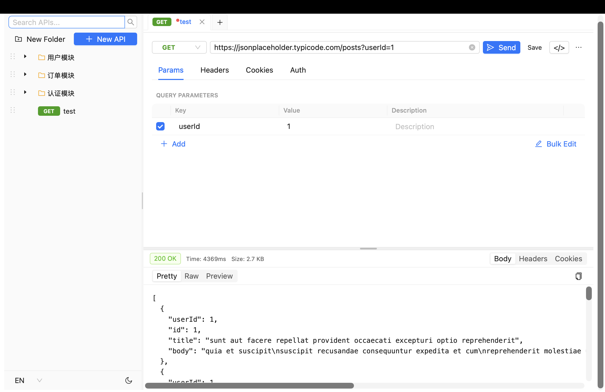
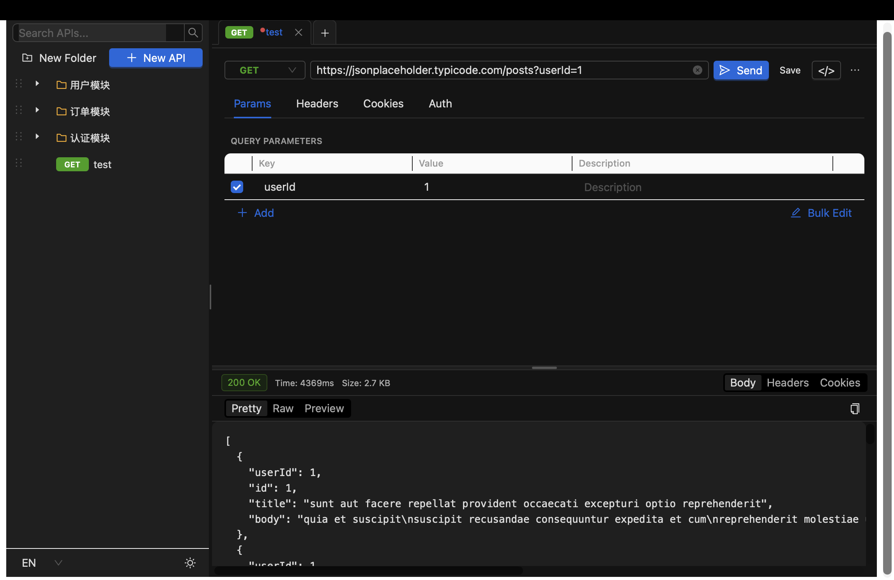

# LiteAPI

本地优先的桌面 API 调试工具，替代 Postman/Apipost 的核心工作流。

## 快速开始

```bash
npm install
npm run tauri    # 桌面应用（无 CORS 限制）
npm run dev      # 仅浏览器模式（调试前端）
```

## 技术栈

| 层 | 技术 |
|----|------|
| 桌面框架 | Tauri v2 |
| 前端 | React 18 + TypeScript + Vite |
| UI | Ant Design 5 |
| 状态管理 | Zustand |
| HTTP 后端 | Rust + reqwest（桌面端，无 CORS） |
| 数据库 | SQLite（bundled，开箱即用） |

## 截图

| 亮色 | 暗色 |
|------|------|
|  |  |

## 核心功能

- **HTTP 请求**：GET/POST/PUT/DELETE/PATCH，Query/Headers/Cookies/Auth/Body 完整配置
- **无 CORS 限制**：桌面端请求走 Rust 后端，不受浏览器同源策略影响
- **集合管理**：文件夹树无限层级，拖拽排序，右键菜单
- **多标签页**：浏览器风格标签栏，支持关闭/复制/脏标记
- **响应查看**：Pretty/Raw/Preview 三种模式，一键复制，固定头部
- **持久化**：关闭重开数据不丢（SQLite 本地存储）
- **亮暗主题 + 中英文**：侧边栏底部一键切换

## 项目文档

| 文档 | 内容 |
|------|------|
| [产品设计](docs/00-产品设计.md) | 定位、原则、目标用户 |
| [功能设计](docs/01-功能设计.md) | 已实现 + 待实现功能 |
| [界面设计](docs/02-界面设计.md) | 布局、组件树、交互原则 |
| [数据模型](docs/03-数据模型.md) | 12 张表结构、级联规则 |
| [接口设计](docs/04-接口设计.md) | Tauri 命令、HTTP 请求结构 |
| [项目规则](docs/05-项目规则.md) | 技术栈、目录结构、命名约定 |
| [开发计划](docs/06-开发计划.md) | P0→P2 优先级 |
| [验收标准](docs/07-验收标准.md) | 功能验收 + 性能 + 稳定性 |
| [部署方案](docs/08-部署方案.md) | 开发/构建命令、产物格式 |

## 开发要求

- Node.js 18+
- Rust 1.77+
- macOS / Windows / Linux
